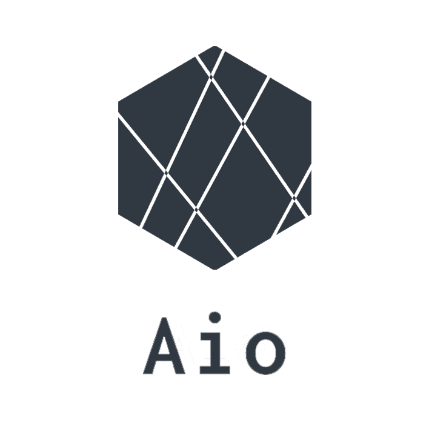

# README

 
 

# アプリケーション名

Aio (for SENTE)

 

# アプリケーション概要

総合商品管理アプリケーション 
（株式会社SENTE仕様）

 

# URL

https://aio-app-35204.herokuapp.com/

 

# テスト用アカウント

Email: test@test.com 
Password: 123abc

 

# 利用方法

ログイン後、各項目管理より登録 
登録情報を使用して、作品登録・在庫管理・請求書発行・作品情報詳細表示等を利用

 

# 目指した課題解決

- 各エクセルに散った情報を一つのアプリケーションにまとめ事務作業の無駄を減らす
- 情報を一箇所に集約することで各所各データの更新差異をなくす
- 請求書発行時の入力の手間、ミスを減らす
- 商品マスタデータの活用

 

# 洗い出した要件

- 作品一覧表示機能
- 作品検索機能
- 作品詳細表示機能
- 作品管理機能
  - ガラスパーツ管理機能
  - 金属パーツ管理機能
  - シリーズ管理機能
  - カテゴリー管理機能
  - 金属材質管理機能
  - オパールカラー管理機能
- 取引先・顧客登録機能
- 請求書出力機能
- 請求書管理機能
- 入出庫管理機能
- 在庫管理機能
- 並び替え機能
- 登録項目複数追加機能
- ユーザー管理機能

 

# 実装した機能についての画像やGIFおよびその説明

## 一覧表示機能、検索機能

 

## 作品登録機能

 

## 詳細表示機能
画像および使用しているパーツ名、必要数表示

 

## 入出庫機能、在庫管理機能
入出庫を入力 作品在庫数に反映

 

## 請求書出力機能
フォームに入力後 出力＋保存

 

## 登録項目複数追加機能
登録項目を任意の数追加および削除、まとめて登録

 

## 並び替えリスト機能(非同期実装)
一覧の並びおよび登録時のプルダウンの並びに反映

 

# 工夫したポイント
- ユーザーが情報を編集できるようにカスタマイズ性を考えたテーブル設計
- PDF出力に開発コストはかかるがカスタマイズ性の高いGemを選び、メンテナンス性をあげた
- アクセシビリティを考えた入力補助を実装（インクリメンタルサーチ・項目追加時金額自動入力）

 

# 課題や今後実装したい機能
- 登録した会社仕様にカスタマイズして使用できるように変更
- APIを活用し、より一つのアプリで全てが完結することを目指す
- Google、Facebookアカウントでの登録を可能にする

 

# 使用技術(開発環境)
## バックエンド
- Ruby
- Ruby on Rails
## フロントエンド
- HTML
- CSS
- JavaScript
## データベース
- MySQL
- Sequel Pro
## インフラ
- Heroku
## ソース管理
- GitHub
- GitHubDesktop
## エディタ
- VSCode

## Gem
- devise  
ユーザー管理

- cocoon  
子テーブル複数データ保存
項目フォーム追加削除

- acts_as_list  
テーブルデータの並び替え機能

- ransack  
検索機能

- prawn, prawn-table  
PDF出力

- active_hash  
擬似モデル作成

- pry-rails  
デバックツール

 

# テーブル設計

## users テーブル

| Column             | Type     | Options                   |
| ------------------ | -------- | ------------------------- |
| company            | string   | null: false               |
| zip_code           | integer  | null: false               |
| prefecture_id      | integer  | null: false               |
| city               | string   | null: false               |
| address            | string   | null: false               |
| building           | string   |                           |
| phone_number       | string   | null: false               |
| bank               | string   | null: false               |
| branch             | string   | null: false               |
| bank_type_id       | integer  | null: false               |
| bank_number        | integer  | null: false               |
| bank_account       | string   | null: false               |
| email              | string   | null: false, unique: true |
| encrypted_password | string   | null: false               |

### Association

- has_many clients

 

## clients テーブル

| Column           | Type       | Options                        |
| ---------------- | ---------- | ------------------------------ |
| name             | string     | null: false                    |
| percentage       | integer    | null: false                    |

### Association

- belongs_to :user

 

## items テーブル

| Column          | Type       | Options                        |
| --------------- | ---------- | ------------------------------ |
| name            | string     | null: false                    |
| price           | integer    | null: false                    |
| collection      | references | null: false, foreign_key: true |
| category        | references | null: false, foreign_key: true |
| material        | references | foreign_key: true              |
| opal_color      | references | foreign_key: true              |
| chain_name      | string     | null: false, unique: true      |
| position        | integer    | null: false                    |

### Association

- has_one_attached :image
- has_many :item_parts
- has_many :item_glasses
- belongs_to :collection
- belongs_to :category
- belongs_to :material
- belongs_to :opal_color
- has_one :stock

 

## item_parts テーブル

| Column   | Type       | Options                        |
| -------- | ---------- | ------------------------------ |
| item     | references | null: false, foreign_key: true |
| part     | references | null: false, foreign_key: true |
| quantity | integer    | null: false                    |

### Association

- belongs_to :item
- belongs_to :part

 

## parts テーブル

| Column   | Type       | Options                        |
| -------- | ---------- | ------------------------------ |
| name     | string     | null: false                    |
| material | references | null: false, foreign_key: true |
| position | integer    | null: false                    |

### Association

- has_many :item_parts
- belongs_to :material

 

## item_glasses テーブル

| Column   | Type       | Options                        |
| -------- | ---------- | ------------------------------ |
| item     | references | null: false, foreign_key: true |
| glass    | references | null: false, foreign_key: true |
| quantity | integer    | null: false                    |

### Association

- belongs_to :item
- belongs_to :glass

 

## glasses テーブル

| Column        | Type       | Options                        |
| ------------- | ---------- | ------------------------------ |
| name          | string     | null: false                    |
| opal_color    | references | foreign_key: true              |
| position      | integer    | null: false                    |

### Association

- has_many :item_grasses
- belong_to :opal_color 

 

## collections テーブル

| Column        | Type       | Options     |
| ------------- | ---------- | ----------- |
| name          | string     | null: false |
| position      | integer    | null: false |

### Association

- has_many :items

 

## categories テーブル

| Column        | Type       | Options     |
| ------------- | ---------- | ----------- |
| name          | string     | null: false |
| position      | integer    | null: false |

### Association

- has_many :items

 

## materials テーブル

| Column        | Type       | Options     |
| ------------- | ---------- | ----------- |
| name          | string     | null: false |
| position      | integer    | null: false |

### Association

- has_many :items
- has_many :parts

 

## opal_colors テーブル

| Column        | Type       | Options     |
| ------------- | ---------- | ----------- |
| color         | string     | null: false |
| position      | integer    | null: false |

### Association

- has_many :items
- has_many :glasses

 

## invoices テーブル

| Column            | Type       | Options     |
| ----------------- | ---------- | ----------- |
| issue_date        | date       | null: false |
| issue_number      | integer    | null: false |
| content           | string     |             |
| client_name       | string     | null: false |
| client_percentage | integer    | null: false |

### Association

- has_many :invoice_items

 

## invoice_items テーブル

| Column     | Type       | Options                        |
| ---------- | ---------- | ------------------------------ |
| invoice    | references | null: false, foreign_key: true |
| chain_item | string     | null: false                    |
| size       | string     |                                |
| price      | integer    | null: false                    |
| quantity   | integer    | null: false                    |

### Association

- belongs_to :invoice

 

## stocks テーブル

| Column     | Type       | Options                        |
| ---------- | ---------- | ------------------------------ |
| item       | references | null: false, foreign_key: true |
| quantity   | integer    | null: false                    |

### Association

- belongs_to :item
- has_many :inventories

 

## inventories テーブル

| Column     | Type       | Options                        |
| ---------- | ---------- | ------------------------------ |
| stock      | references | null: false, foreign_key: true |
| date       | date       | null: false                    |
| content    | string     |                                |
| quantity   | integer    | null: false                    |
| in_out_id  | integer    | null: false                    |

### Association

- belongs_to :item
- has_many :inventories